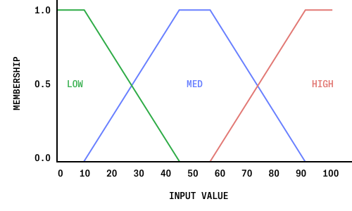

<h1 align="center"><a href="https://guinane.xyz/CISC-467-Implementation">
<br>
Coffee for Fuzzy Logicians</a></h1>
<h4 align="center">Building a Fuzzy Expert System for At-Home Coffee Brewing</h4>
<p align="center">
<em>CISC-467 Term Paper<br>
Jack Guinane<br>
Dr. Robin Dawes<br>
December 18th, 2019</em>
</p>

---

## Abstract

There are many attributes that make up a cup of coffee: its flavour, acidity, and amount of caffeine, to name a few. There are a similarly large number of choices one can make when brewing coffee to increase or decrease those attributes: the origin of the coffee bean, grind coarseness, brewing method, et cetera.  This paper considers, and then later implements, a fuzzy logic expert system that determines the optimal brewing strategy to achieve the inputted set of coffee characteristics. Fuzzy logic is an appropriate choice for the system, as taste (coffee or otherwise) is an incredibly subjective and imprecise metric.

## Introduction

Coffee is one of the most popular beverages in the world, accounting for over 70% of the hot-beverage market (Hamaker). For those who do not frequent coffee shops, there are many ways to brew coffee at home, often with much better results at a cheaper price. The *best* way, however, is very subjective and entirely depends on the desired qualities of the coffee. Without years of experience, controlling the many input variables may seem complicated, and the results may be sub-par. This paper puts forth a fuzzy expert system that is designed to determine the best course of action to brew a user-defined cup of coffee.

Fuzzy logic is a fitting choice for this system, due to the fuzziness intrinsic to coffee taste. Coffee can be bright and acidic, or it can be dark and full, and it is often somewhere in between. Whether or not a cup of coffee is sweet is seldom just true or false, since people’s tastes are usually more nuanced than classical logic can represent. Even the qualities used to describe coffee in this paragraph (“dark,” “full,” “bright,” et cetera) are unspecific terms. For these reasons, fuzzy logic, and subsequently a fuzzy expert system are necessary to capture and make use of the vague, poorly defined, and fuzzy ways in which coffee is talked about (and thus, thought about).

The usefulness of fuzzy logic in the domain of coffee has been identified and explored by others, such as Nurhayati and Pramanda’s fuzzy decision system to determine coffee roasting *time*, Fauziyah, Adhisuwignjo, Rifai, and Dewatama’s system to control roasting *temperature*, and the caffeine-intake fuzzy decision system I overheard my fellow CISC-467 classmate say she was doing as her implementation. The fuzzy expert system discussed in this paper does not handle any of these three tasks (although it could certainly work well in tandem with any or all). Instead, this system only considers the desired characteristics of the coffee and attempts to determine the best brewing method to use, roast of bean (dark, medium, or light), and level of sugar.

## Inputs and Outputs

Before choosing the variables to consider as input, I first considered what the output of the system would be. This was done in order to ensure that the desired characteristics of the coffee could be achieved by the outputs available to the system. For example, since “quantity of water” was not included as an output, the input “amount of coffee” cannot be controlled for, and is thus not included as an input. The outputs, as previously mentioned, are:


- **Brew method:** the output that represents the device the user should use to brew the coffee for the best results. The possible states are:
    - “Moka Pot”: [a stove-top espresso maker](https://bluebottlecoffee.com/preparation-guides/bialetti-moka-pot)
    - “French Press”: [a type of immersion-based brewer](https://bluebottlecoffee.com/preparation-guides/french-press)
    - “Aeropress”: [a relatively new immersion-based brewer](https://bluebottlecoffee.com/preparation-guides/aeropress)
    - “Pour-Over”: [the standard drip-method](https://bluebottlecoffee.com/preparation-guides/pour-over)
- The states exist on a continuum, ordered in terms of their characteristics: Moka Pot, French Press, Aeropress, Pour-Over. These brew methods were chosen as they cover a wide range of brewers, and are some of the most common devices. They also happen to all be products I have in my house at the time of writing.
- **Roast type:** the output that represents the suggested roast of the beans. The three most common roasts, and the possible states of the system, are:
    - Dark roast
    - Medium roast
    - Light roast
    These are ordered along a continuum, from Light to Dark roast.
- **Sugar:** the amount of sugar to put in the coffee. While adding sugar to coffee is often frowned-upon by coffee aficionados, it is a common practice for many people. I have included it as it will help produce more accurate results for those who enjoy it. The value of “Sugar” can be anywhere from 0 (no sugar added) to 2 teaspoons of sugar (equivalent to two sugar cubes), however, for simplicity, the values are rounded down to the nearest quarter-teaspoon (since that is the highest precision people will be able to adhere to). The maximum value of 2 teaspoons of sugar was chosen as it is the amount of sugar present in a Tim Hortons’ Double-Double.

These three output variables were selected as they will likely be available to anyone who is interested in coffee. Variables that do not affect the characteristics of the coffee (such as quantity) were omitted, as were variables that were too complex to be meaningfully controlled (such as coffee bean variety). While the coarseness of the coffee grounds does affect the taste, I decided that it was more important to use the suggested grind-coarseness of the selected brewing method.

For the fuzzy system’s input, I chose to use the terms used by baristas and coffee-enthusiasts to describe the taste of a cup of coffee. Biscaia defines four attributes: aroma, body, acidity, and flavour (Biscaia). However, since the system does not determine the best coffee bean variety to use (the input also does not work well as an integer value), the “aroma” and “flavour” attributes have been omitted as inputs. Instead, the system takes in “Caffeine” and “Sweetness.” The inputs chosen  are the most subjectively preferred aspects of a coffee, while also the most controllable. Each input is taken as a value from 0 to 100, with 0 and 100 representing the scales described below:

- **Caffeine:** the caffeination levels of the coffee, from LOW to HIGH.
- **Body:** described as the coffee’s “weight on your tongue” (Biscaia), from CLEAN to FULL.
- **Acidity:** the brightness of the coffee, from LOW to HIGH.
- **Sweetness:** how sweet the coffee is, from BITTER to SWEET.


## Fuzzification

The system takes input values as integers from 0 to 100. To fuzzify these values, a membership function is used to determine the inputs membership in the sets LOW, MED (medium), and HIGH. For the values “Caffeine,” “Body,” and “Acidity,” the straight-forward membership function shown below is used.





This membership function provides a desired amount of fuzziness, while reflecting the natural definition of each of these sets. The input “Sweetness,” however, is fuzzified using its own unique membership function:
 


The function for “Sweetness” has a more gradual transition from LOW to MED, and a slightly sharper change from MED to HIGH. This shift is done to reflect the desires of the user better. While those who like a high sweetness enjoy a large amount of sugar, those who do not will likely desire very little—if any at all. By exaggerating the slopes from LOW to MED, the system can produce more nuanced results while still allowing for high volumes of sugar.


## T-Norm, S-Norm, and Negation

The system is defined using the Probabilistic T-Norm and S-Norm outlined in Iancu’s Mamdani Type Fuzzy Logic Controller (Iancu):

```
T(p, q) = pq
S(p, q) = p + q - pq
```

These norms were chosen for their subtle radial-shape, to produce more gradual results. Natural negation was selected for its simplicity:

```
N(x) = 1 - x
```

No implication operator was selected as the system does not use implication at any point.


## Rules

The system uses 14 rules in total, between four and five rules for each output. Since there are three different outputs the system is determining, I have grouped the rules on that basis.

#### Sweetness
The “Sugar” output is fairly straight forward, as there is a “Sweetness” input. These two values are proportional, and the rules one through three reflect that. However, the “Sweetness” input is not the sole contributor to this output. Additionally, if the user has selected a high amount of caffeine, the system will suggest adding a bit more sugar. This is done because sugar helps contribute to the alerting effects of coffee, and can, therefore, help produce satisfying results at higher “Caffeine” settings. In order to not over-weight these caffeine-based rules, “Sugar” is set to high if, and only if, “Caffeine” is high and “Sweetness” is either high or medium. If “Sweetness” is low, “Sugar” is set only to medium. This ensures that there will never be a high-sugar output when “Sweetness” is set to low.


1. If **SWEETNESS** is **HIGH,** then **SUGAR** is **HIGH**
2. If **SWEETNESS** is **MED,** then **SUGAR** is **MED**
3. If **SWEETNESS** is **LOW,** then **SUGAR** is **LOW**
4. If **CAFFEINE** is **HIGH** and **SWEETNESS** is **NOT LOW,** then **SUGAR** is **HIGH**
5. If **CAFFEINE** is **HIGH** and **SWEETNESS** is **LOW,** then **SUGAR** is **MED**

#### Roast Type
The “Roast type” output determines which type of bean to use, Light roast, Medium roast, or Dark roast. The roast of the bean has an impact on the level of caffeine (Light roast being the most caffeinated, Dark roast being the least), since longer roast times cook off the caffeine. The roast also has a sizable effect on the flavour, with Dark roasts having a fuller body, and Light roasts having higher acidity. The first two rules account for the acidity levels. The second two rules use a combination of “Caffeine” and “Body” to produce more accurate results: “Roast” should be Light when “Caffeine” is high, but only when “Body” is not high. “Roast” should be Dark when “Body” is high *or* when “Caffeine” is low.


6. If **ACIDITY** is **HIGH,** then **ROAST** is **LIGHT**
7. If **ACIDITY** is **LOW,** then **ROAST** is **DARK**
8. If **CAFFEINE** is **HIGH** and **BODY** is **NOT HIGH,** then **ROAST** is **LIGHT**
9. If **CAFFEINE** is **LOW** or **BODY** is **HIGH,** then **SUGAR** is **HIGH**

#### Brew Type
The brewing method has arguably the most significant impact on the characteristics of a cup of coffee. As previously mentioned, the brewing methods used by the system have been arranged in order of their characteristics: Moka Pot, French Press, Aeropress, Pour-Over. From left-to-right, the caffeine amounts decrease, the fullness of the body decrease, and the acidity increases. The following rules reflect these effects:

10. If **CAFFEINE** is **HIGH,** then **BREW** is **MOKA**
11. If **CAFFEINE** is **LOW** and **ACIDITY** is **NOT LOW,** then **BREW** is **POUR-OVER**
12. If **BODY** is **HIGH** and **ACIDITY** is **LOW,** then **BREW** is **FRENCH-PRESS**
13. If **BODY** is **LOW** and **ACIDITY** is **HIGH,** then **BREW** is **POUR-OVER**
14. If **BODY** is **LOW** and **ACIDITY** is **LOW,** then **BREW** is **AEROPRESS**


## Defuzzification

Once the rules have been computed, they are scaled by their truth value, and the center-of-mass is found. This is done discretely for each of the three outputs. Center-of-mass was chosen over center-of-area in order to better utilize the rules previously defined, since many overlap in their output. Each crisp output value is then quantized (the crisp value’s highest membership), since “brew type” and “Roast type” can not be implemented continuously (there is no half-Moka-Pot-half-French-Press device available). “Sugar” is quantized to the nearest half-teaspoon for user-convenience. 


## Implementation

JavaScript was chosen for its ubiquity, allowing the system to run on nearly any computer in a web browser. It also allowed for the most user-friendly interface (discussed further below). The system is mainly comprised of two JavaScript files, one containing general fuzzy logic functions and the other containing the specific steps of this system. Note that this section is quite long, as I have included code snippets—jump to page 16 to skip to the Conclusion section.

To begin, four sliders are setup (standard HTML input sliders) as well as the three outputs (just `<span>` tags). A listener is created for each slider, and the fuzzy system is run whenever a change is detected (this is done in the `init()` function on lines 1 to 43 of `initializer.js`) 

The first step of the system is to fuzzify the inputs (lines 45 to 82 of `initializer.js`). An object is created for each variable, with functions `isLow()`, `isMed()`, and `isHigh()`, returning the membership of the variables current value in each fuzzy set, respectively. The value is determined by constructing the membership functions defined at the start of this paper, and getting the value at the slider’s current position. For example:

```javascript
caffeine = 
{
  isLow: buildMembershipFunction(0,0,10,45).getAt(caffeine_input.value),
  isMed: buildMembershipFunction(10,45,55,90).getAt(caffeine_input.value),
  isHigh: buildMembershipFunction(55,90,100,100).getAt(caffeine_input.value)
}
```

The function `buildMembershipFunction()` takes four integer inputs: `start`, `peak_start`, `peak_end`, and `end`, that describe the four points of a standard trapezoidal membership function. It returns a membership-function-object, which has a single function: `getAt()`, which returns the membership at the inputted point.

A similar process is done to initialize the output variable, where an object is created for each. The output object has weighing variables, each instantiated at zero, and corresponding “is” function. For example:

``` javascript
sugar =
{
  low_weight: 0,
  med_weight: 0,
  high_weight: 0,

  isLow: function (weight) { sugar.low_weight += weight; },
  isMed: function (weight) { sugar.med_weight += weight; },
  isHigh: function (weight) { sugar.high_weight += weight; },
  defuzz: function () { ... }
 }
 ```

The `isLow()`/`isMed()`/`isHigh()` functions take in a weight, and increment their respective weight variable by that amount. Unlike the input-objects’ “is low” functions, the output-objects’ are a statement (“this value *is* low”) rather than a question (“is this value low?”). This makes handling rules very easy and human-readable (see further down). Since the system uses a combination of scaling and center-of-mass, the weights of each membership can be stored as a single sum. The center-of-mass function used in the object’s `defuzz()` function simply multiplies the values of the membership function by the weight of that set, before finding the center of mass. The crisp value returned is then run through a simple if-statement to quantize it.

```javascript
// the defuzzification function for Sugar
defuzz : function ()
{
  var crisp = centerOfMass([
    {"fn": buildMembershipFunction(0, 0, 20, 40), "weight": sugar.low_weight}, 
    {"fn": buildMembershipFunction(20, 40, 60, 80), "weight":sugar.med_weight}, 
    {"fn": buildMembershipFunction(60, 80, 100, 100), "weight": sugar.high_weight}
  ]);

  // convert crisp value into words
  if(crisp < 30) { return "no sugar"; }
  else if(crisp < 40) { return "a pinch of sugar"; }
  else if(crisp < 50) { return "1 teaspoon of sugar"; }
  else if(crisp < 55) { return "1&frac14; teaspoons of sugar"; }
  else if(crisp < 70) { return "1&frac12; teaspoons of sugar"; }
  else if(crisp < 85) { return "1&frac34; teaspoons of sugar"; }
  else { return "2 teaspoons of sugar"; }
}
```

The center-of-mass function takes a single list of dictionaries as input, structured as a membership object, `"fn"`, and the weight of that membership, `"weight"`. The function iterates through the list, polling the mass at evenly spaced increments of ten (everything is on a scale of 0 to 100).While some precision is lost calculating the mass in this way, it is a much easier operation to perform and produces nearly equivalent results (Iancu).

The next step is to define all of the rules (lines 176 to 193 of `initializer.js`). The function `rule()` takes in a conditional and a consequent. The conditional’s truth value is calculated automatically into a float value from zero to one (inclusive). The consequent is an output object’s “is” function, and the truth value of the consequent is added to that weight.

```javascript
/* Example: "IF x is High, THEN y is Low" becomes: rule(x.isHigh, y.isLow) */
function rule(conditional, consequent)
{
  consequent(conditional);
}
```

Each rule defined in the Rules section is converted into this format. Once each rule has been computed, the outputs are defuzzified and inserted into the HTML interface. (`and()`, `or()`, and `not()` are simple functions that perform the T-Norm, S-Norm, and negation described above).

## Conclusion

Overall, the system seems to work reasonably well. After building the implementation, I tested the results with a few coffee-enthusiasts who all reported that the results seemed quite comparable to the conclusion they themselves might come to. I further tested it with some less-expert people (including myself), and actually brewed the coffee the system suggested. The results were pretty good.

There are two main problems with the system that I have noticed. The first is that not all conceptual coffees are physically possible. While the system allows a user to input a low-caffeine, high-body, and high-acidity coffee, there is not really any way of making that. The system’s result, a medium roast coffee using a pour-over dripper and no sugar, is as close as one could get, but not great. This problem can be easily spotted by the fact that lowering the inputted “Body” value to zero, still produces the exact same result (which fits better in this second case, but is the same because there is nothing the system can change to better generate the former case). Unfortunately, the only solution to this problem would be to add more output parameters (such as decaf or regular coffee, country of origin of the bean, et cetera), dramatically increasing the complexity.

The second problem is that each output is “unaware” of the other two. This means that when, for example, “Caffeine” is increased, all three outputs adjust to increase their caffeine amounts. This problem is furthered by the quantization that is required for the “Brew” and “Roast” outputs. Given that this is a *fuzzy* expert system, it is not particularly desirable to have such large “jumps” in results. These massive changes in outcome from tiny changes in the input are the exact thing fuzzy logic is supposed to reduce. So while relatively rare in the system, it would still be something to work out in future revisions.

One potential solution is to offset the membership functions, so that each output reaches its inflection point at a different value, and changes over in a graduated order.

### Acknowledgements
Special thanks to Quinn Pollock and Maxwell Keleher, whos coffee expertise (and book (Carlsen and Michelman)) helped guide me as I constructed this rule system.

## References

1. Biscaia, Cátia. “Coffee Taste Characteristics.” Coffeemuseum.Com (blog), December 2, 2016. [http://www.coffeemuseum.com/blog/2016/12/02/coffee-taste-characteristics/]().

2. Fauziyah, M, S Adhisuwignjo, M Rifai, and D Dewatama. “Based Fuzzy Logic Temperature Control for a Coffee Roaster Machine.” IOP Conference Series: Materials Science and Engineering 434 (December 3, 2018). [https://doi.org/10.1088/1757-899X/434/1/012202]().

3. Hamaker, Sarah. “Strong Brew.” NACS Magazine, April 11, 2009. [https://web.archive.org/web/20110103085719/http://www.nacsonline.com/NACS/Magazine/PastIssues/2009/April2009/Pages/CCUHotDisp.aspx]().

4. Iancu, Ion. “A Mamdani Type Fuzzy Logic Controller.” Fuzzy Logic - Controls, Concepts, Theories and Applications, March 28, 2012. [https://doi.org/10.5772/36321]().

5. Nurhayati, S., and D. Pramanda. “The Coffee Roasting Process Using Fuzzy Mamdani.” IOP Conference Series: Materials Science and Engineering 407 (September 2018). [https://doi.org/10.1088/1757-899X/407/1/012122]().

6. Carlsen, Zachary and Michelman, Jordan. “The New Rules of Coffee.” Ten Speed Press, New York. September 25, 2018.

